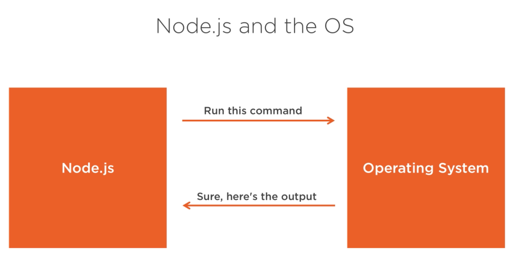
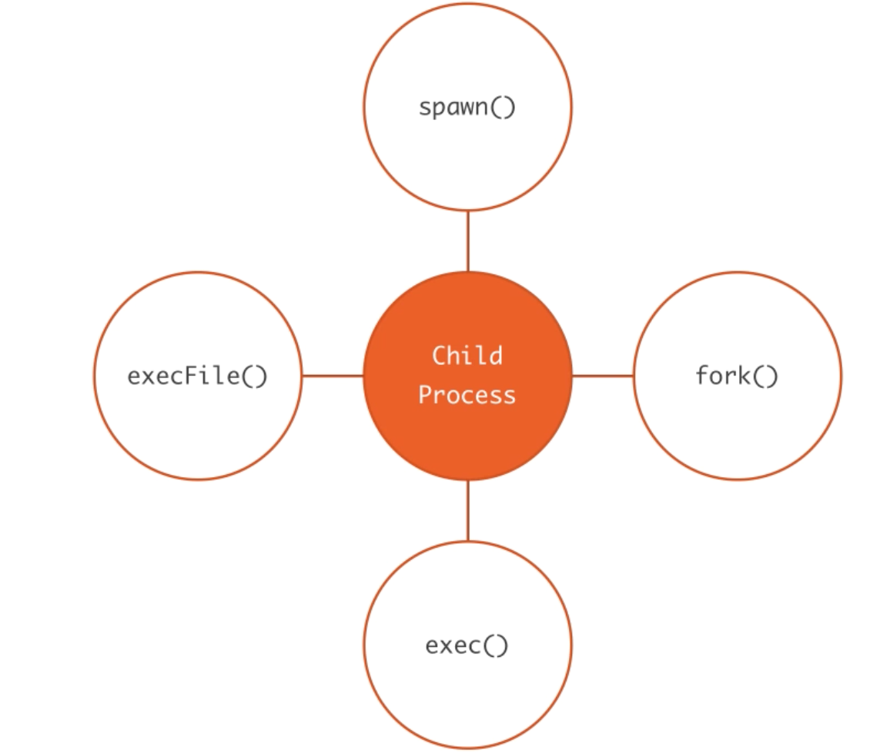
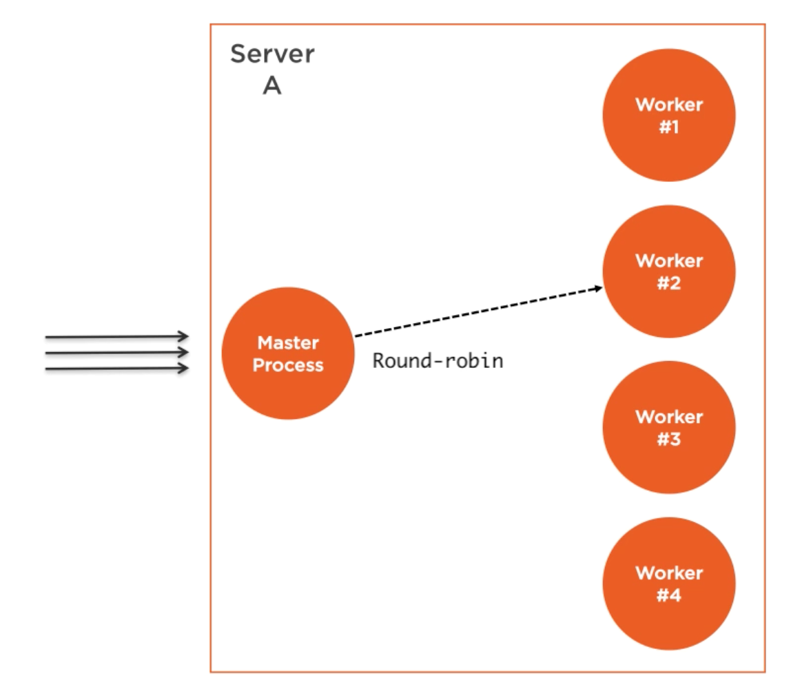

# Node.js Clusters
- Single threaded non-blocking performance is quite good to start with.
- Eventually, one process and one CPU is not going to be enough to handle increasing load of application.
- No matter how powerful server you use can be, what a single thread can be supported as limited.
- The fact that Node.js runs on single threaded, does not mean that we can't take advantage of multiple process or multiple machines.
- Using multiple process is only way to scale Node.js application
- Node.js is designed to build distributed applications with many notes.
- This is why it is called `node.js`
- Scalability is baked into platform

Following are reasons to scale applications
- Workload
- Availability
- Fault tolerance

# Scalability strategies
- Cloning
- Decomposing (micro services)
- Splitting into multiple instances (like sharding for mongodb)

# Child Process Events and Standard IO
- We can easily spin child process using node js child_process nodule
- These child process can easily communicate to each other using messages communications
- child_process enable us to use operating system functionality by running any system command inside the child process



## Ways to create child process
Following are ways to create child process.



- All of the child process module function has synchronous blocking version that will wait until spawn process exit.
- Useful for scripting task


## spawn
```
const {spawn} = require('child_process');
const child = spawn('pwd'); // returns child_process instance which implements node.js event emitter api

child.on('exit', (code, signal)=>{
  console.log(`child process exit with code ${code} for signal ${signal}`);
  // code is 0 if child process exit normally
  // signal is null if child process exit normally
})
```
Events on child are
- exit
- disconnect
- error
- message
- close

`message` event is important. It is trigger when child process use process.send() method to send message.

Every child process gets three standard io process
- child.stdin
- child.stdout
- child.stderr

`child.stdin` is writable stream.

Note: Use `ctr+d` to pass input from `process.stdin` to `child.stdin`

- `swpan` can also be forced to use `shell` if `shell` is set as true.
```
const {spawn} = require('child_process');
const child = spawn('find . f | wc -l', {
stdout: 'inherit',
shell: true,
cwd: '/Users/dilip/Download,
env: {} // manually defined env variable
});
```

## exec
- By default `spawn` method does not create a shell to execute the command
- `exec` method does create shell
- `swapn` is better compare to `exec`
- `exec` buffers the command generated output and pass the whole value to callback function.
- since `exec` uses shell command therefore we can use shell command directly.
- `exec` is good when expect small output. Since it buffers the data therefore can be a problem for big size.
- `swpan` is much better when data return is big, bcz it returns streams of standard i/o.
```
const { exec } = require('child_process');
exec('find . -type f | wc -l ', (err, stdout, stderr) => {
  if (err) {
    console.error(`Error occurred `, stderr);
    return;
  }
  console.log(`Number of files ${stdout}`)
});
```

## execFile
- run a file without a shell
- It is same as exec

# fork
- It is a variation of `spawn` function to spawn a node process.
- The biggest difference between `spawn` and `fork` is that a communication channel is established between the child process.

# cluster module
- It enables load balancing over an environment multiple cpu core
- It helps to implement cloning stratagies on single machine with high computation power
- Always use the cluster module



`cluster.js`
```
const cluster = require('cluster');
const os = require('os');
if (cluster.isMaster) {
  const cpus = os.cpus().length;
  console.log(`Forking for ${cpus} CPU`);
  for (let i = 0; i < cpus; i++) {
    cluster.fork();
  }
} else {
  require('./server')
}

```
`server.js`
```
const http = require('http');
const server = http.createServer();
const pid = process.pid;
server.on('request', (req, res) => {
  for (let i = 0; i < 1e9; i++) {
    // Simulate CPU work before responding
  }
  res.end(`Handled by process pid ${pid}`)
})
  .listen(8181, ()=>{
    console.log(`Server process started at pid ${pid}`)
  });
```

# Simulate load testing of http server
```
➜  node-clusters-child-process ab -c200 -t10 http://localhost:8181/hello

This is ApacheBench, Version 2.3 <$Revision: 1826891 $>
Copyright 1996 Adam Twiss, Zeus Technology Ltd, http://www.zeustech.net/
Licensed to The Apache Software Foundation, http://www.apache.org/

Benchmarking localhost (be patient)
Finished 8 requests


Server Software:
Server Hostname:        localhost
Server Port:            8181

Document Path:          /hello
Document Length:        28 bytes

Concurrency Level:      200
Time taken for tests:   10.325 seconds
Complete requests:      8
Failed requests:        0
Total transferred:      824 bytes
HTML transferred:       224 bytes
Requests per second:    0.77 [#/sec] (mean)
Time per request:       258119.150 [ms] (mean)
Time per request:       1290.596 [ms] (mean, across all concurrent requests)
Transfer rate:          0.08 [Kbytes/sec] received

Connection Times (ms)
              min  mean[+/-sd] median   max
Connect:        0    9   3.7     11      11
Processing:  1232 4668 2948.6   5267    9022
Waiting:     1232 4667 2950.4   5267    9022
Total:       1243 4678 2950.3   5278    9032

Percentage of the requests served within a certain time (ms)
  50%   5278
  66%   6537
  75%   7749
  80%   7749
  90%   9032
  95%   9032
  98%   9032
  99%   9032
 100%   9032 (longest request)
```


